> ___Ссылка на резюме: [https://spb.hh.ru/resume/2f7197aeff0badaa400039ed1f475365596e32](https://spb.hh.ru/resume/2f7197aeff0badaa400039ed1f475365596e32)___

## Работа в компании Спецобувьоптом, сайт PATboot.ru (2018 - 2022)

- Контент-маркетинг (статьи и медиа) позволил максимально подробно рассказать о продукции компании, а также получить аудиторию по второстепенным и информационным запросам.
- Написано более 500 статей, обзоров, новостей и акций.
- Выпущено более 80 видеороликов.
- Работа с новыми рекламными площадками повысила узнаваемость бренда: Instagram, Telegram, Youtube, Дзен и даже канал в TikTok (более 340 тыс. просмотров).
- Выполнена чистка, расширение и кластеризация семантического ядра.
- Внедрение страниц-первоисточников (канонических) для сокращения числа дублей.
- Анализ сайтов конкурентов, в т.ч. зарубежных обувных компаний ([небольшая часть такого анализа](competitors.png)).
- Внедрение Google Tag Manager для успрощения правок внешнего вида сайта.
- Выполнена унификация карточек моделей обуви.
- Появилась форма подписки на email-рассылки, поиск по сайту, отзывы на сайте, поиск по прайс-листу.

### Медиа

#### Youtube-канал

> — &gt; 80 видео, &gt; 500 подписчиков.
> 
> — **Ссылка:** https://www.youtube.com/@patbootcom/videos
> 
> — Мной выполнялся весь процесс выпуска видео: сценарий, съемка, монтаж и постпроизводство.

Ролик-обзор с ведущей:


Лучшее короткое видео:


Типичный ролик-обзор:


#### Instagram&#42;

> — &gt; 350 публикаций, &gt; 900 подписчиков
> 
> — **Ссылка:** https://www.instagram.com/patboot_spb/
> 
> — Фото- видеосъёмка, оформление постов, Reels, Stories

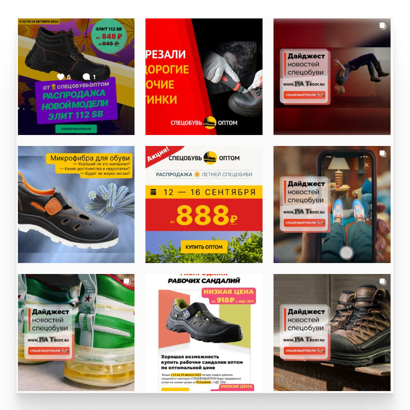

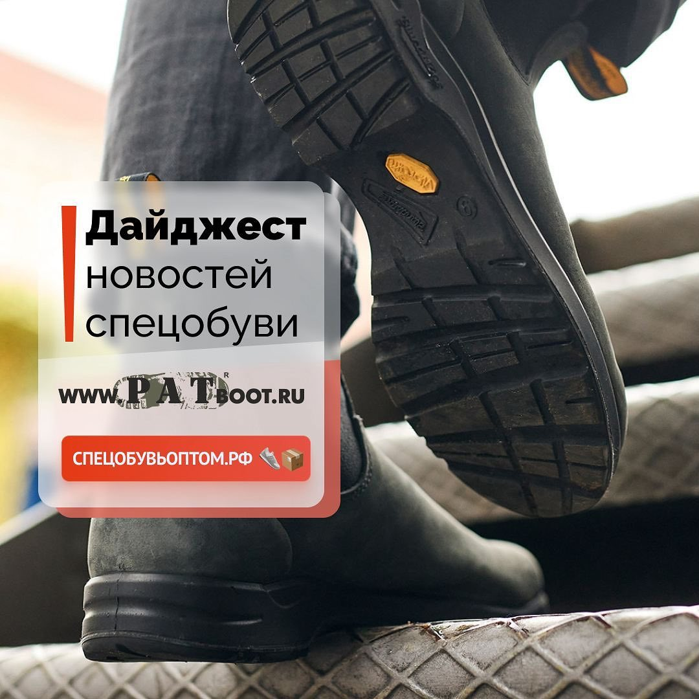
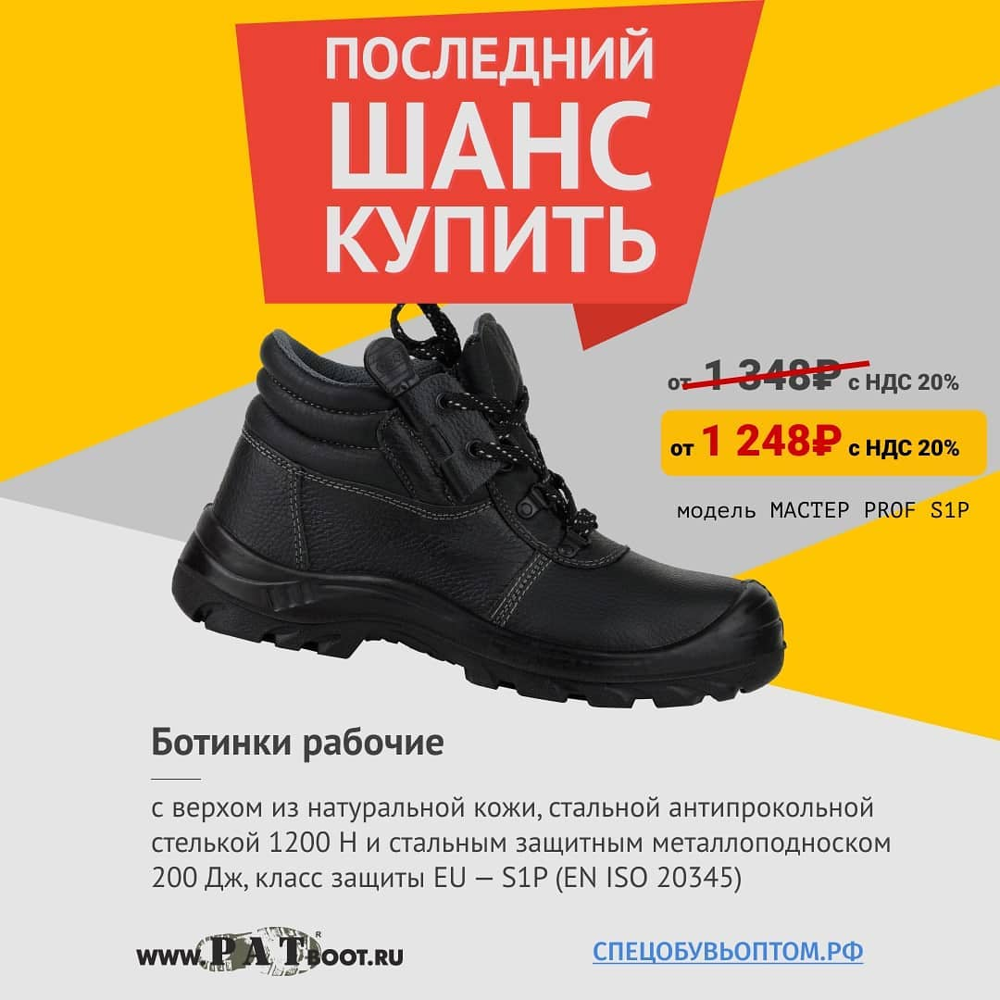
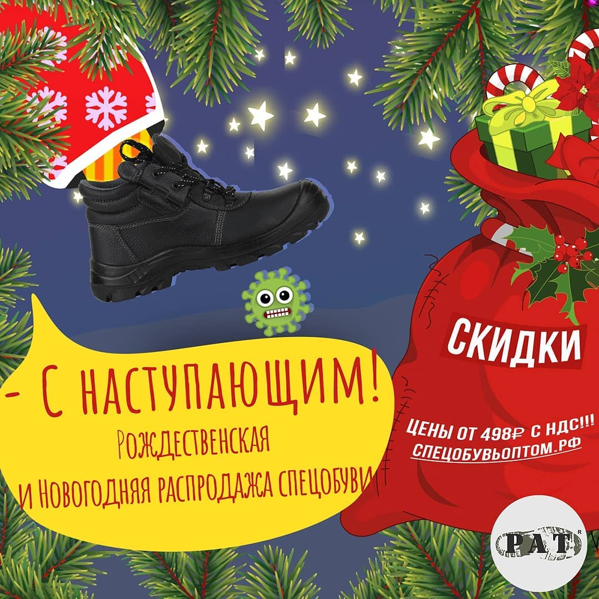
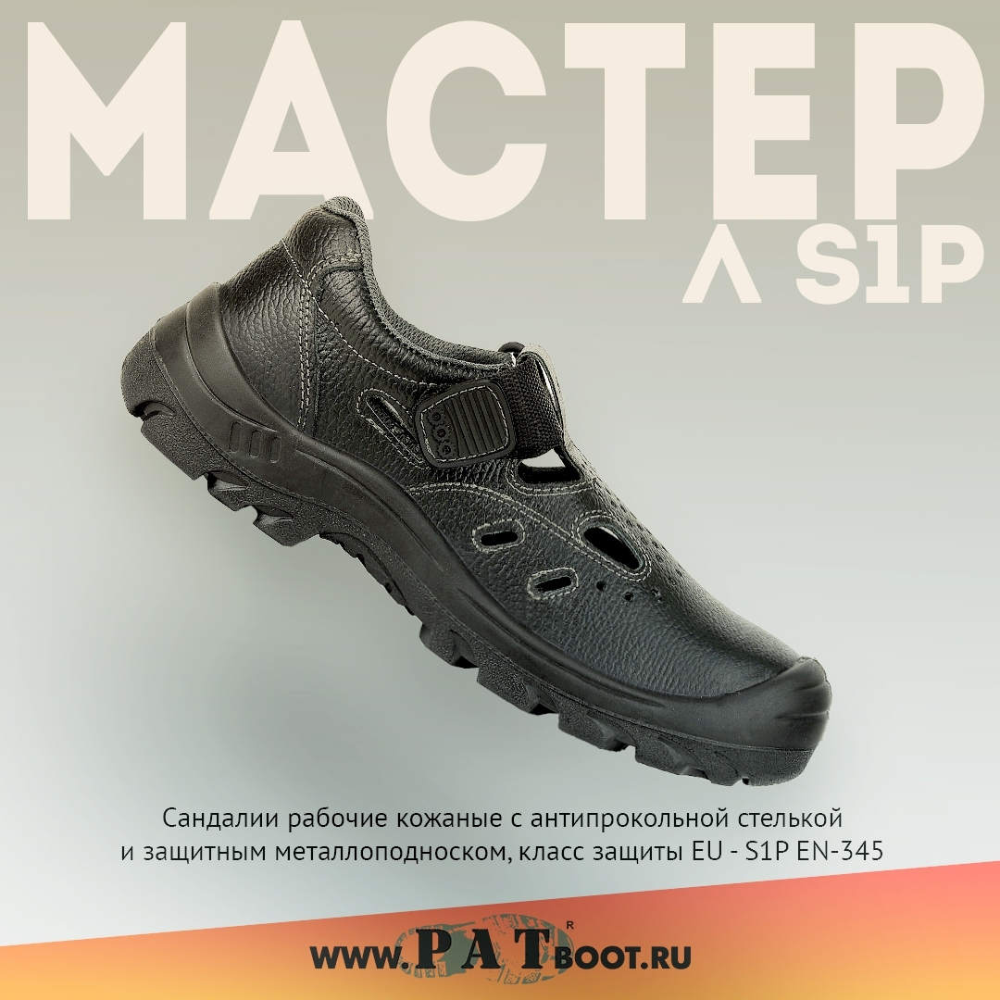

&#42;Запрещён в РФ

#### Дзен

> &gt; 400 публикаций, &gt; 550 подписчиков
> 
> **Ссылка:** https://dzen.ru/patboot
> 
> Написание и оформление статей

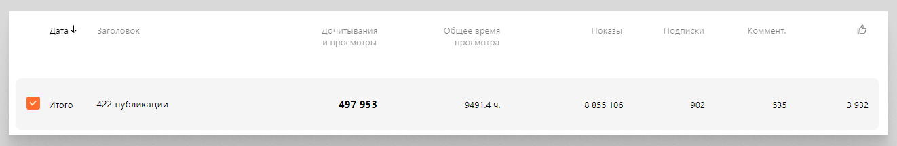

#### TikTok

> — &gt; 1500 подписчиков, **&gt; 340.000 просмотров**
> 
> — **Ссылка:** https://www.tiktok.com/@patboot
> 
> — Видеосъемка, монтаж

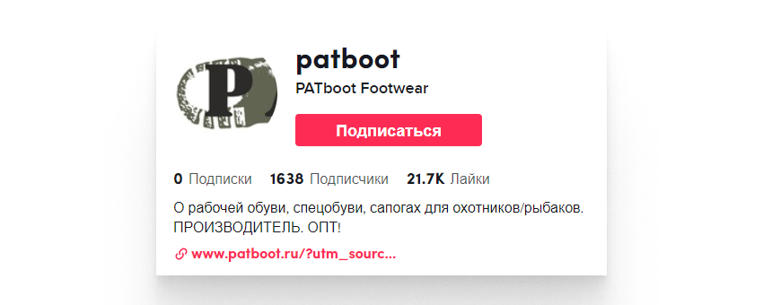

### PATboot.com

Для бренда неопреновых сапог был создан отдельный сайт — [PATboot.com](https://patboot.com/).

Изготовил макет, выполнил вёрстку, установку и запуск сайта (в качестве CMS выбрал MODX).

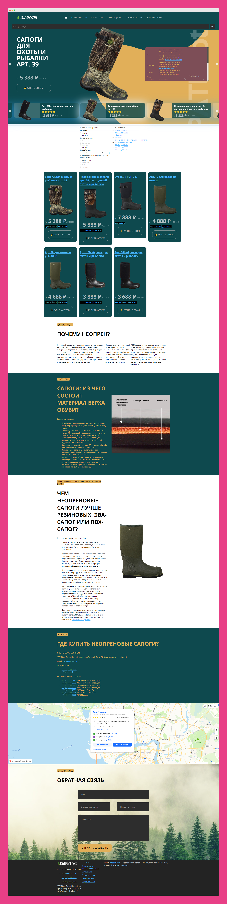
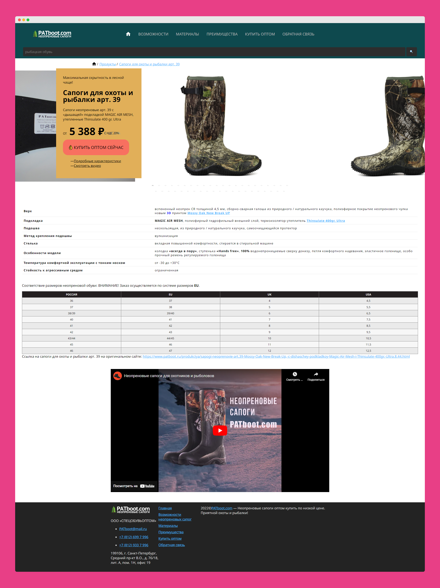

### Статьи

За время работы написал более 500 статей, обзоров, новостей и текстов акций для компании-производителя рабочей спецобуви. Ссылка на все статьи: https://www.patboot.ru/news/.

Несколько примеров статей:

> **Эксперты советуют: не покупайте зимнюю и летнюю спецобувь, когда есть эти модели от СПЕЦОБУВЬОПТОМ!**
> 
> Большая статья о том, почему две отдельные модели демисезонных ботинок лучше, чем те зимние рабочие ботинки, которые клиент может купить своим работникам в цех или на склад.
> 
> Ссылка: https://www.patboot.ru/news/2022/eksperti-sovetuyut-ne-pokupayte-zimnyuyu-i-letnyuyu-specobuv,-kogda-est-eti-modeli-ot-specobuvoptom.493.html

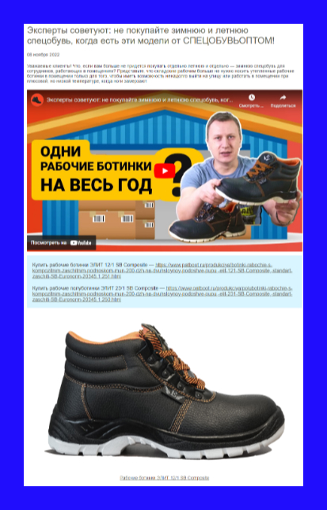

> **Дайджест новостей спецобуви #93: от мозолей спасает японский душ!**
> 
> Один из дайджестов новостей спецобуви, которые обычно выпускались 1-2 раза в месяц. Таких дайджестов 95 штук.
> 
> Ссылка: https://www.patboot.ru/news/2022/daydzhest-novostey-specobuvi-93-ot-mozoley-spasaet-yaponskiy-dush.517.html

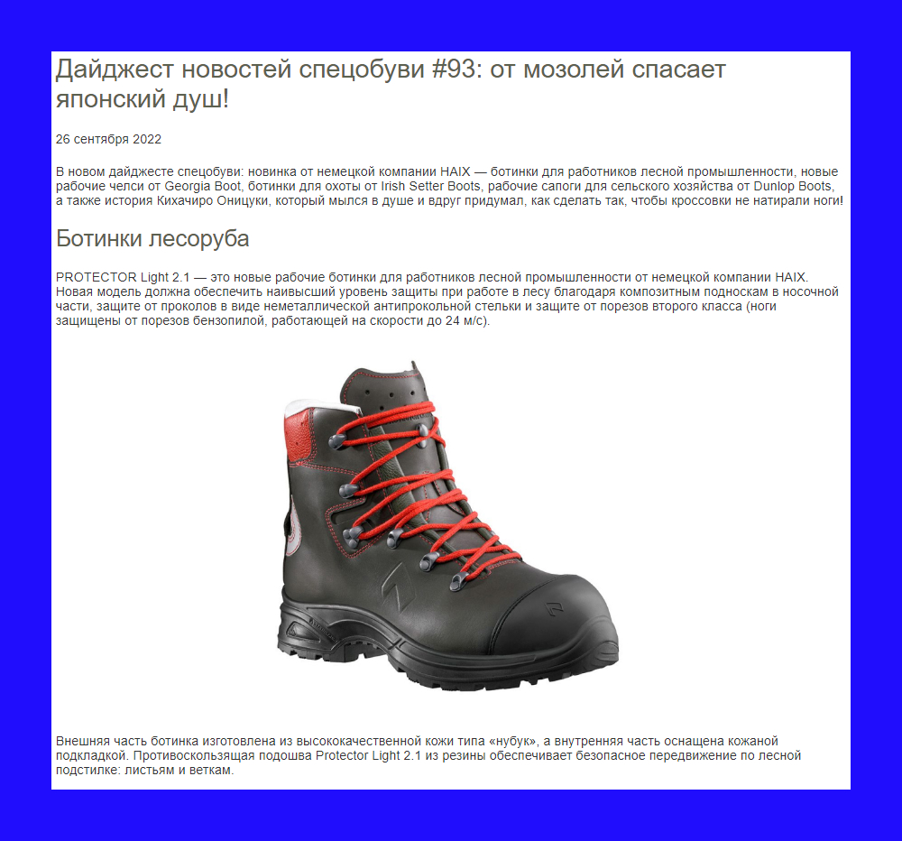

> **НОВИНКА! Сапоги для особо низких температур САЛЕХАРД ПОЛАР ФОКС**
> 
> Детальный обзор новой модели.
> 
> Ссылка: https://www.patboot.ru/news/2020/novinka-sapogi-dlya-osobo-nizkih-temperatur-salehard-polar-foks.420.html

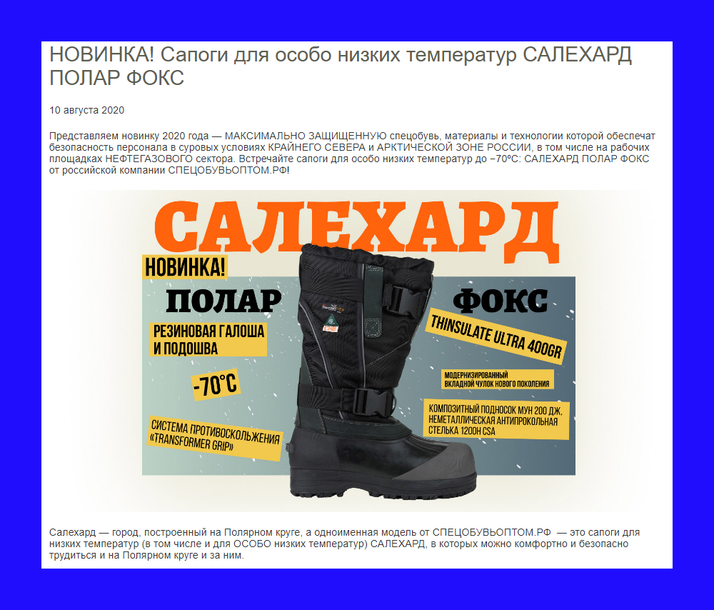

## Работа в компании ГК Строй-Эксперт (2014 - 2018)

### Примеры выполненных сайтов

Одностраничник компании, работающей с историко-культурной экспертизой и разработкой научно-проектной документации (вёрстка, администрирование):

Сайт компании-поставщика услуг оснащения сцены (вёрстка, администрирование).

Сайт арендной квартиры в Санкт-Петербурге:

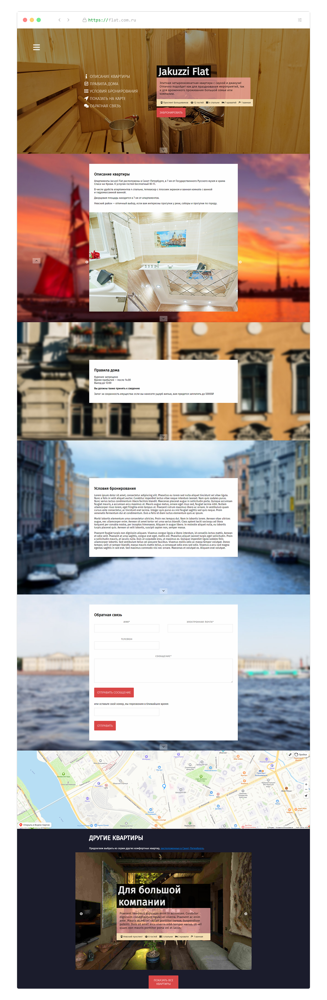

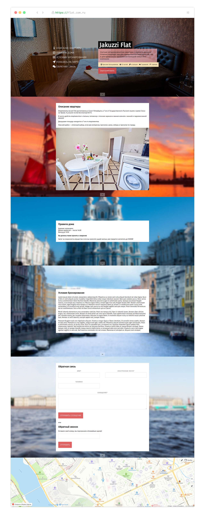

## Еще

### 90-days.ru

Выполнил разработку сайта оздоровительного центра Бехтеревой Н. С.

### 7шагофф

Создал в After Effects рекламный анимационный ролик для соцсетей (тестовое задание).


