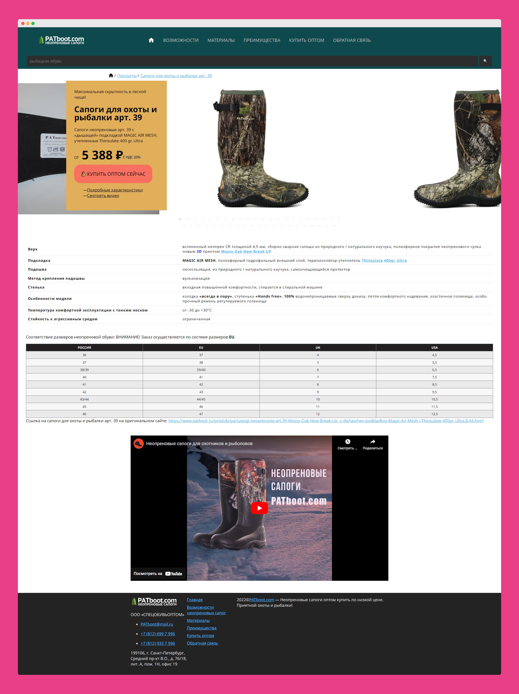
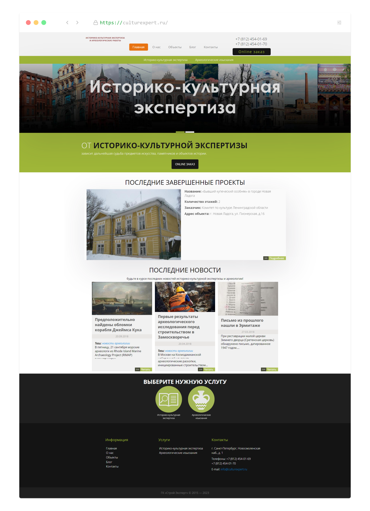
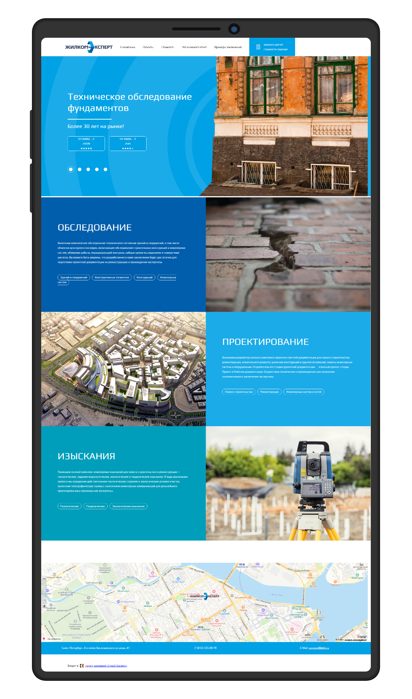
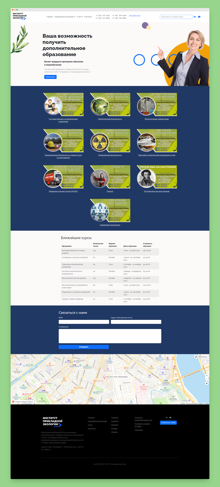

**Сарапулов Андрей Игоревич**

Основные направления деятельности: SEO, SMM, контент-маркетинг, вебмастеринг (HTML, CSS, Jquery, Bootstrap, в качестве CMS чаще всего использую MODX и Wordpress).

Основное резюме (SEO): https://spb.hh.ru/resume/3f19d8d2ff09d26bfc0039ed1f34746550736f

## Примеры выполненных сайтов

### artproject.uz

https://artproject.uz/ — мультиязычный (ru, en, uz) сайт компании, работающей в сфере продаж сценического оборудования.

### PATboot.com

Сайт для бренда неопреновых сапог — [PATboot.com](https://patboot.com/).

### culturexpert.ru

https://culturexpert.ru

Сайт компании, работающей в сфере историко-культурной экспертизы

### techobsled.ru

https://techobsled.ru/

Сайт строительной компании, работающей в сфере технического обследования зданий.

### Добрый город

Одностраничник компании, работающей с историко-культурной экспертизой и разработкой научно-проектной документации (вёрстка, администрирование):

### atlant-project.ru

https://atlant-project.ru/

Первая версия сайта компании-поставщика услуг оснащения сцены (вёрстка, администрирование).

### flat.com.ru

Сайт арендной квартиры в Санкт-Петербурге (вёрстка):

### 90-days.ru

Выполнил разработку сайта оздоровительного центра Бехтеревой Н. С.

###  АНО ДПО "ИПК "Прикладная экология"

Выполнил дизайн макета сайта организации, обеспечивающей образовательные услуги

