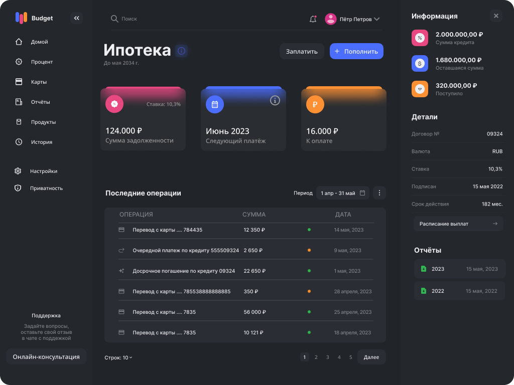
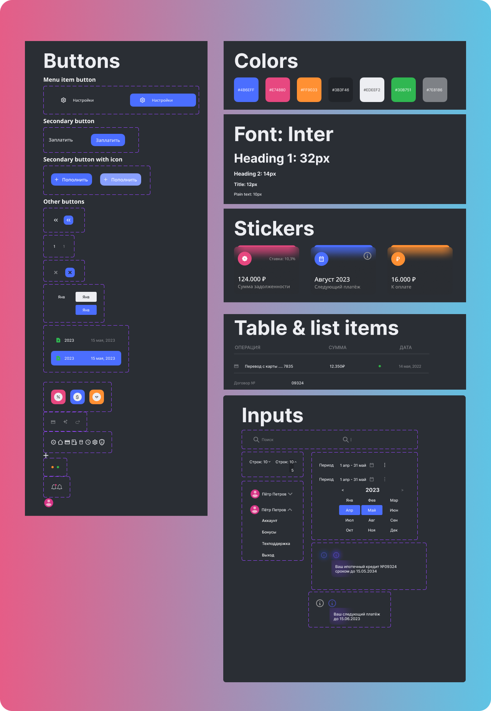
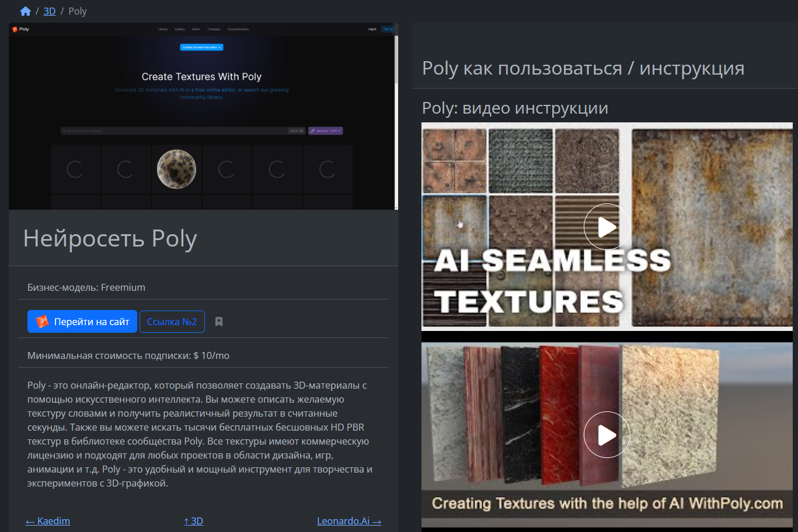
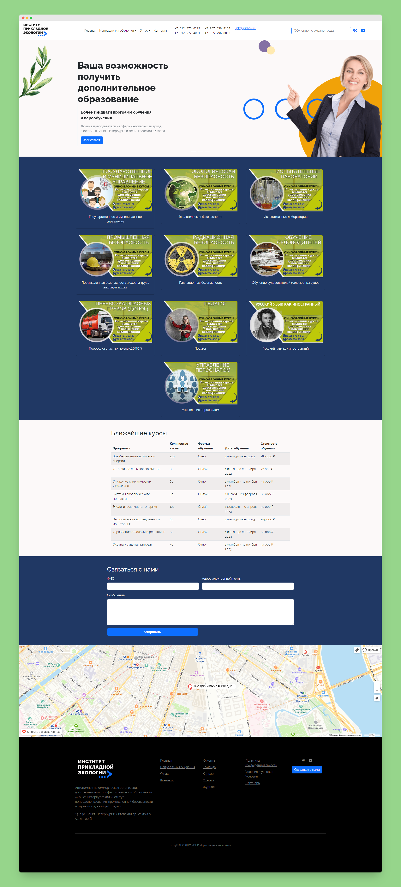
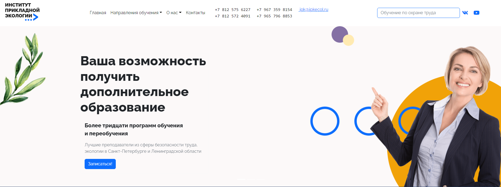
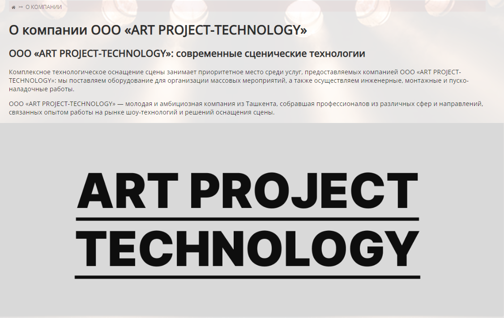

+++
title = "Нужен сайт? Помощь в SEO? Дизайн? Вам сюда!"
description = "Приветствую, меня зовут Андрей Сарапулов, я SEO-специалист, эксперт по интернет-рекламе и вебмастер из Санкт-Петербурга."
tags = [ "резюме", "SEO", "веб-разработка", "дизайн" ]
slug = "hi"
image = "index.svg"
date = "2023-05-22"
weight = 1
cover_enabled = false
content_enabled = false
toc = false
draft = true
+++

Мои контактные данные:
- srplvv@gmail.com
- https://t.me/a_sarapulov

## Последние проекты
 

 

 

Полностью моё портфолио можно посмотреть здесь: [/page/portfolio/](/page/portfolio/).