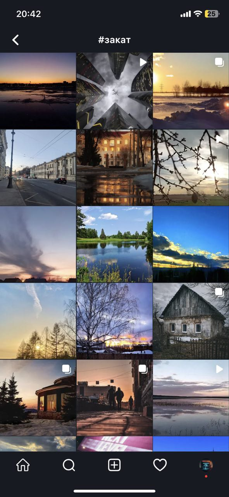

+++
title = 'NOW или никогда: обзор неинстаграмщика'
description = 'Обзор социальной сети Now, которая способна заменить ваш запрещённый Инстаграм'
tags = [ 'соцсеть', 'обзор']
slug = 'now-ili-nikogda-obzor-neinstagramschika'
image = 'now.jpg'
date = '2023-03-20'
categories = ["Технологии"]
+++

## Факты и домыслы

- Now — это новая соцсеть в узнаваемом формате.
- Весна 2022 — более удачного времени для выхода российского аналога Instagram* и не придумаешь.
- Весна 2022 — более неудачного времени для выхода российского IT-продукта не придумаешь.
- Now разработали бывшие работники Яндекса.
- Они хранят контент в облачных решениях от Google и Яндекс.
- Приложение работает даже из Крыма.
- Now app не хотели регистрировать в Appgallery от Huawei, из-за “общих слов” в названии.

Ссылки:

- https://nowapp.me/ - сайт
- https://apps.apple.com/ru/app/urbanspoon/id1615654829 - для Айфона
- https://play.google.com/store/apps/details?id=com.marinin.nowapp - для Андроида

## Моя история

Итак, май 2022, у меня уже есть рабочий аккаунт в новой соцсети, одной из тех, “которая должна заменить Instagram”. Я еду в метро и, поглощенный толпой, открываю знакомый тёмный интерфейс и завожу *свой* аккаунт @ruphoto. Слегка удивляюсь тому, что такой ник может быть свободен.

Конечно, я хочу создать аккаунт, аналогичный тысячам популярнейших каналов в Инсте - с фотографиями российской глубинки, добиться хороших показателей и продавать рекламу. Все горизонты свободны.

[Первой фотографией](https://nowapp.me/p/bc4096a0-c932-11ec-9b3f-bd8e34b788e1) я заливаю работу С. М. Прокудина-Горского “Река Вытегра в Вологодской области”. Нет никаких сомнений, что русский пейзаж столетней давности отзовется в сердцах пока еще не существующих подписчиков. Так и происходит. Первых лайков ждать не пришлось и мне отсыпали достаточное количество “сетевого внимания”.

Уже потом, через несколько месяцев, сотни постов и отработку некоторого количества аккаунтов, я понимаю, что если уж и заниматься чем-то, то **с душой**, поэтому сильно сбавляю темпы, переключаю внимание на другие проекты. 

Сейчас у меня в комплекте личный аккаунт @asarapulov, @nseti - дополнение к [сайту о нейросетях](https://n-seti.ru/) и @ruphoto, о котором я писал выше.

## Обзор Now глазами обычного человека

Как вы поняли, гонка за рекламными воротилами (и накрутчиками) оказалась не по мне. Зато теперь пользуюсь Now в своё удовольствие. И вот благодаря чему.

Первое, что я увидел еще в 22-м - темная тема, сетка фотографий, лента и поиск. И уже тогда это было хорошим и рабочим приложением.

### Темы 

Сейчас в Now три темы: светлая, тёмная и тёмный океан.

### Быстродействие
Приложение очень шустрое, я ни разу не встречал даже подлагиваний, хотя в 2022-м видел сообщения о том, что лента могла бы скроллиться плавнее, скорее всего, теперь исправили и это.

### Моменты — сториз

Вместо сториз здесь “Моменты”. Они доступны из домашнего экрана и по тапу на аватар.

При создании собственных моментов можно добавлять текст в нескольких вариантах оформления,  хэштеги, упоминание и ссылку, можно что-то изобразить кистью, а так любимых многими GIF-анимаций здесь пока нет.

### Сообщения — директ

Сообщения (Директ) доступны по свайпу вправо от домашнего экрана с лентой или по тапу в правом верхнем углу.

Абсолютно идентичные инсте диалоги (во всех смыслах):

### Лента

Лента (кажется) выстроена в хронологическом порядке, поэтому пользователи Now не пропускают публикации из-за сложных систем рейтинга.



Посты, как и положено, содержат лайки, комментарии, подпись, кнопку “Поделиться” и сохранить в закладки + можно скопировать ссылку на пост, но посмотреть в браузере ее будет нельзя - у Now пока нет браузерной версии.

Пост может содержать несколько фотографий, но не более 10.



Пост может содержать видео. Помню, когда добавили эту фукнцию весь Now был завален видеопостами, причем авторскими.

Система комментариев тоже вполне себе комфортна: можно отвечать и лайкать и редактировать свои комментарии. Если вышли, не отправив комментарий, то приложение сохранит текст на всякий случай.

### Действия

На этом экране собраны комментарии к вашим постам, упоминания вашего аккаунта и сообщения о новых подписчиках.

Так иконка Действий сигнализирует о новых действиях:

### Поиск

При переходе в раздел Поиска Now показывает сетку постов из рекомендаций. Кстати, раз в сутки любому доступно одно “продвижение”, скорее всего, ваш пост попадет именно сюда. 

Доступен поиск по именам пользователей, подписям к профилям и хэштегам.

### Профиль

В профиль можно вставить ссылку и вообще встретить привычное описание, состоящее из рекламы и emoji.

Как я уже говорил, у меня есть несколько аккаунтов, с недавних пор, таким, как я, стало легче - теперь можно легко переключаться между аккаунтами при помощи длительного нажатия на иконку экрана Профиля.



## Хотелки

1. Большой раздел с рекомендациями
2. Desktop-приложение или веб-версия
3. Доступное и бесконечное “Избранное”, чтобы я скриншоты эти себе не через Telegram пересылал, а чтобы внутри

&#8902;Instagram запрещен в России, и это нормально.