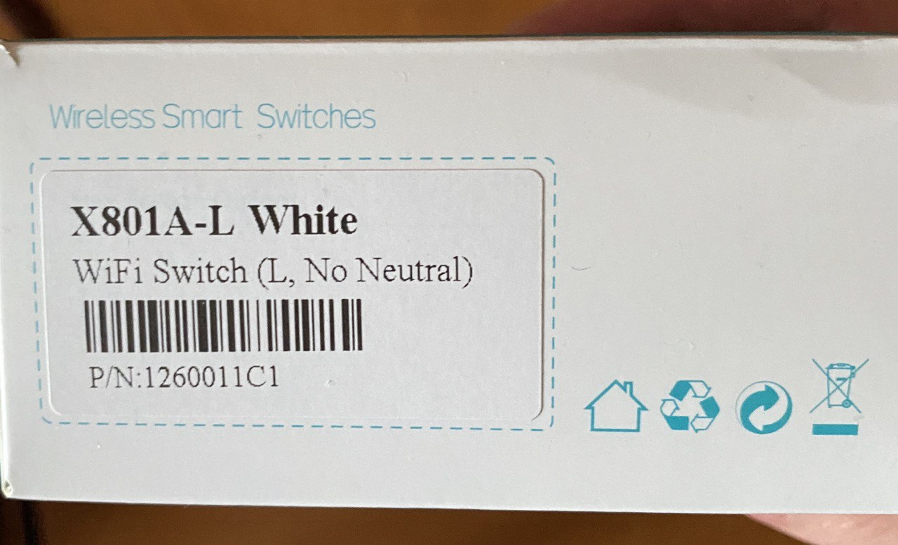

+++
title = 'Умный выключатель WiFi Switch L, No Neutral X801A-L White  - как подключить'
description = 'Умный выключатель одноклавишный без нуля WiFi Switch (L, No Neutral) X801A-L White - как сделать так, чтобы им можно было управлять со смартфона?'
tags = [ 'умный дом', 'Яндекс']
slug = 'umnyy-vyklyuchatel-wifi-switch-l-no-neutral-x801a-l-white-kak-podklyuchit'
image = 'title.jpg'
date = '2023-07-19'
categories = ["Технологии"]
+++

Умный выключатель одноклавишный без нуля WiFi Switch (L, No Neutral) X801A-L White - как сделать так, чтобы им можно было управлять со смартфона?

В инструкции к WiFi Switch (L, No Neutral) X801A-L White на английском языке рекомендуется скачать Digma SmartLife, но в этом приложении нет нужного устройства. Расскажу - как быть.

1. Первым делом бросаем Digma SmartLife куда-нибудь в корзину и скачиваем просто “Smart Life”, вот ссылки:

- iOS: https://apps.apple.com/ru/app/smart-life-smart-living/id1115101477
- Android: https://play.google.com/store/apps/details?id=com.tuya.smartlife
- Android доп: https://4pda.to/forum/index.php?showtopic=975327

2. Устанавливаем Smart Life и регистрируемся
3. Находим в меню свой выключатель и производим его сброс, вводим данные вашего WI-FI и начинаем пользоваться

Кстати, по умолчанию если выключатель - выключен, то индикатор также держится в выключенном состоянии. Это можно будет перенастроить в настройках выключателя в приложении Smart Life!

К Умному дому Яндекса и Алисе этот выключатель подключаем также - через приложение Яндекс и набор от Smart Life, не от Digma.