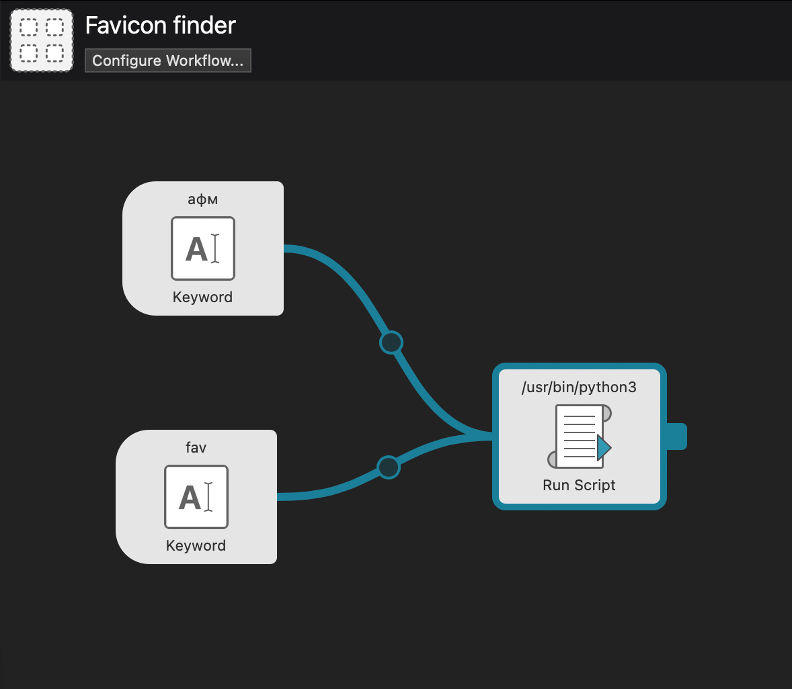

+++
title = 'Alfred для macOS: пара автоматизаций'
description = 'Две небольших автоматизации для Alfred, которые позволяют получать favicon из url, а также копировать id видео из адреса видео в Youtube'
tags = [ 'mac', 'автоматизация']
slug = 'alfred-dlya-macos-para-avtomatizaciy'
image = 'index.jpg'
date = '2023-12-14'
categories = ["Технологии"]
+++

Иногда нам страсть как нужна автоматизация простых действий: для этого на mac как никто другой подойдет Alfred:  мощный инструмент для автоматизации задач и управления файлами на macOS. Кстати, для Windows рекомендую [Listary](https://www.listary.com/).

## Отделение id от адреса видео Youtube

Иными словами, нам нужно превратить https://www.youtube.com/watch?v=h9DuoJ6Tcrk в *h9DuoJ6Tcrk*.

Работать это будет так: пользователь вызывает Alfred (option + пробел), пишет команду `cu https://www.youtube.com/watch?v=h9DuoJ6Tcrk`, нажимает Ввод и в буфере получает id.


Создайте новый рабочий поток:

1. Откройте настройки Alfred и перейдите в раздел "Workflows".

- Нажмите на "+" в нижнем левом углу, чтобы добавить новый рабочий поток.

2. Добавьте "Input" (Ввод):

- Выберите "Inputs" (Ввод) в левом боковом меню и добавьте "Keyword" (Ключевое слово).
- Назовите ключевое слово, например, "cu" (что означает "YouTube Code").

3. Добавьте "Run Script" (Запустить сценарий):

- Выберите "Actions" (Действия) в левом боковом меню и добавьте "Run Script" (Запустить сценарий).
- В разделе "Script" выберите "Bash Script" (Сценарий на Bash).
- Введите следующий скрипт на Bash:

```
url=$1
videoID=$(echo $url | awk -F '[=&]' '/watch\?/{print $2}')
echo $videoID | tr -d '\n' | pbcopy
```

Этот скрипт извлекает идентификатор видео из URL YouTube и копирует его в буфер обмена.




## Получение favicon по URL-сайта

Более сложная задача, которая потребует установки Python, но, насколько я помню, в macOS он устанавлен по умолчанию.

В чем заключается задача: пользователь вызывает Alfred и в поисковой строке пишет команду: `fav https://n-ber.ru`, в ответ скрипт открывает в новой вкладке браузера фавиконку сайта.

Поиск фавиконок - та еще задача, поэтому я решил подключить библиотеку favicon: `pip install favicon`. В процессе неизбежны ошибки, поэтому скрипт должен о них сообщать -- там же, в браузере.

1. Создайте новый рабочий поток:

- Откройте настройки Alfred и перейдите в раздел "Workflows".
- Нажмите на "+" в нижнем левом углу, чтобы добавить новый рабочий поток.

2. Добавьте "Input" (Ввод):

- Выберите "Inputs" (Ввод) в левом боковом меню и добавьте "Keyword" (Ключевое слово).
- Назовите ключевое слово, например, "fav" (от "favicon").

3. Добавьте "Run Script" (Запустить сценарий):

- Выберите "Actions" (Действия) в левом боковом меню и добавьте "Run Script" (Запустить сценарий).
- В разделе "Script" выберите "Language: /usr/bin/python3" и вставьте код на Python.

4. Сохраните и настройте триггер:

- Нажмите "Save" (Сохранить) в верхнем правом углу.
- Присвойте триггер (комбинацию клавиш или ключевое слово) для активации этого рабочего потока.


А вот и скрипт:
```
import sys
from favicon import get
import webbrowser

url = sys.argv[1]
user_agent = 'Mozilla/5.0 (Macintosh; Intel Mac OS X 10_9_3) AppleWebKit/537.36 (KHTML, like Gecko) Chrome/35.0.1916.47 Safari/537.36'
headers = {'User-Agent': user_agent}

try:
    icons = get(url, headers=headers, timeout=2)
    if icons:
        icon_url = icons[0].url
        print(f"Открываю фавикон: {icon_url}")
        sys.stdout.flush()
        webbrowser.open(icon_url)
    else:
        error_message = f"Favicon not found for the site: {url}. " \
                        f"Open <a target='_blank' href='view-source:{url}'>site's source code</a> manually."
        webbrowser.open(f"data:text/html,{error_message}")
except Exception as e:
    error_message = f"An error occurred: {e}. " \
                    f"Open <a target='_blank' href='view-source:{url}'>site's source code</a> manually."
    webbrowser.open(f"data:text/html,{error_message}")

```

Вот такие очень узкоспециализированные скрипта для Alfred, но на то он и Alfred, чтобы помогать в прикладных задачах :-)
