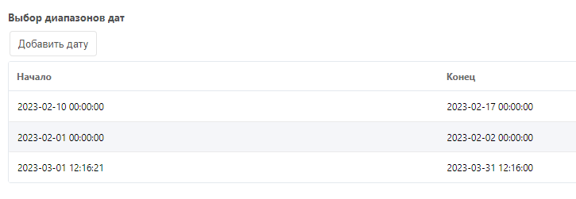

# Диапазон дат в MODX с помощью MIGX

Потребовалось мне как-то добавить к ресурсу MODX неограниченное количество диапазонов дат. Так бывает нужно, например, если ресурс - это учебный курс, который проводится несколько раз в год с такой-то дату по такую-то, и надо это как-то выводить.

Что надо делать:

1. Установить MIGX
2. Переходим в Управление → MIGX → Добавить элемент
3. В поле Name вводем имя “datePicker”
4. Открываем вкладку Formtabs → Добавить элемент
5. В поле “Caption” вводим “Диапазон дат”
6. Тамже рядом с “Fields” находим Добавить элемент и жамкаем
7. В появившемся окне вводим:
- Fieldname - “start_date”
- Caption - “Начальная дата“
- Input TV - “dateStart”
- Input TV type - “date”
- Жмем “Сохранить и закрыть”
8. Снова жмем на “Добавить элемент” и добавляем такие параметры:
- Fieldname - “end_date”
- Caption - “Конечная дата“
- Input TV - “dateEnd”
- Input TV type - “date”
- Жмем “Сохранить и закрыть”
9. Множество раз жмем “Сохранить и закрыть” пока не закроется всё
10. Создаем TV-поле dateStart, где в параметрах ввода выбираем:
- Тип ввода: Дата
- Выбираем другие параметры, которые по-душе)
11. Создаем другое поле dateEnd с такими же параметрами.
12. Создаем третье ТВ-поле datePickTv и в нем в Параметрах ввода делаем следующее:
- Тип ввода: migx
- Конфигурации: datePicker
- Вкладки формы:
  
  ```
  [
  {
    "caption":"Date Ranges",
    "fields": [
        {
            "field":"start_date",
            "caption":"Start Date",
            "inputTVtype":"date"
        },
        {
            "field":"end_date",
            "caption":"End Date",
            "inputTVtype":"date"
        }
  ]
  }
  ]
  ```

Разметка колонок:

```
[
{"header": "Начало", "width": "160", "sortable": "true", "dataIndex": "start_date"},
{"header": "Конец", "width": "160", "sortable": "true", "dataIndex": "end_date"}
]
```

13. Не забываем добавить это поле к шаблону в “Доступно для шаблонов”, сохраняем, *крестимся* и проверяем…



В шаблоне пишем типа такого:

```
 [[!getImageList? &tvname=`datePickTv` &tpl=`date_range_tpl`]]
```

В чанке:

```
<p>[[+start_date:date=`%d-%m-%Y`]] — [[+end_date:date=`%d-%m-%Y`]]</p>
```
