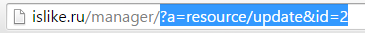
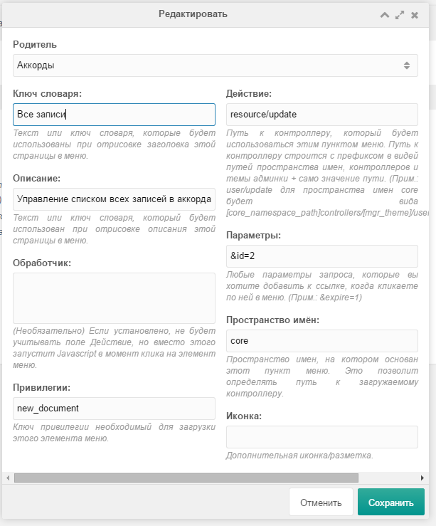
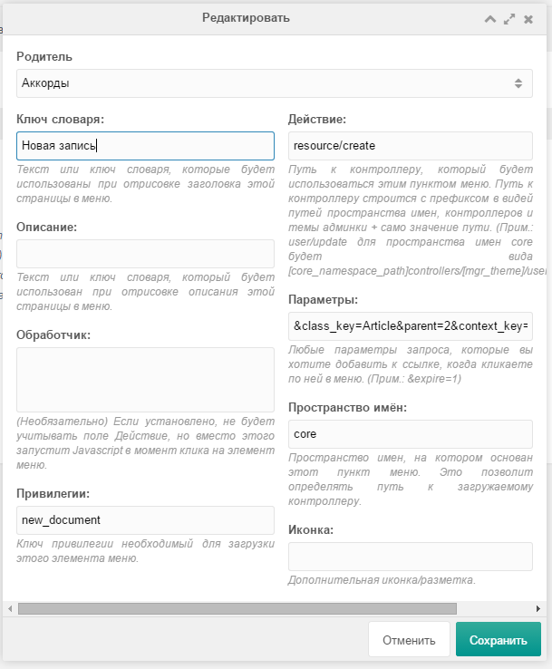
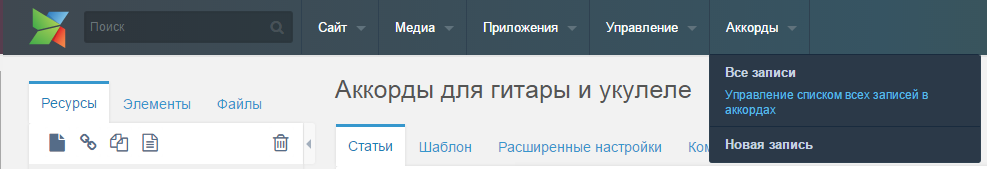

# Добавить новый пункт в шапку админ-панели MODx Revo

В этой заметке я постараюсь объяснить то, как добавить новые пункты меню в шапку админ-панели MODx Revolution. В моем случае эти пункты будут вести в раздел создания новой записи в блоге, а также в сам блог: его административную часть.

**1.** Для начала соберем необходимые данные. Перейдем в админ-панели в свой блог и скопируем url-адрес из адресной строки:

Я получил адрес вот такого вида:

`//manager/?a=resource/update&id=2`

Нажмем кнопку «Новая статья» и проделаем аналогичную операцию. Удалим из полученных адресов блок `http://вашсайт/manager/?a=`. После чего получим в итоге два выражения:

*   Адрес административной части блога: `resource/update&id=**x**`
*   Адрес создания новой статьи: `resource/create&class_key=Article&parent=**x**&context_key=web&template=**y**`

Очевидно, что там, где указаны **x** и **y** — должны быть ваши данные.

**2.** Создадим пункт, в котором будет два подпункта. Нажатие на главный пункт обрабатываться не будет.

Переходим в раздел «Система» -> «Действия». Нажимаем кнопку «Добавить пункт» и вводим следующее:

*   «Родитель» — topnav
*   «Ключ словаря» — название главного пункта
*   «Привелегии» — `new_document`

И нажимаем «Сохранить».

**3.** Затем **обязательно** кликаем правой кнопкой мыши на новом пункте, выбираем «Редактировать» и снова нажимаем «Сохранить». В противном случае данный пункт не попадет в меню «Родитель» (такое вот странное поведение системы).

**4.** Сразу после этого создаем подпункт, по нажатию на который мы отправлялись бы в список всех записей в этом разделе. Снова нажимаем «Добавить пункт» и вводим следующее:

*   «Родитель» — название главного пункта, созданного ранее
*   «Ключ словаря» — название подпункта
*   «Действие» — `resource/update`
*   «Описание» — ваше описание подпункта (необязательно)
*   «Параметры» — `&id=x`
*   «Привелегии» — `new_document`

И сохраняем.

Если обновить страницу, то можно увидеть, что создались два пункта один в другом.

**5.** Создадим второй подпункт, который отправлял бы нас в окно создания новой записи в блоге. Нажимаем «Добавить пункт». Повторюсь, если ваш главный пункт вдруг исчез из списка «Родитель», то просто пересохраняем его! Вводим следующее:

*   «Родитель» — название главного пункта, созданного ранее
*   «Ключ словаря» — название подпункта
*   «Действие» — `resource/create`
*   «Описание» — ваше описание подпункта (необязательно)
*   «Параметры» — `&class_key=Article&parent=x&context_key=web&template=y`
*   «Привелегии» — `new_document`

И сохраняем.

В итоге мы создали три пункта меню в верхнем меню бэкенда админ панели MODx: главный и два подпункта.

Замечу один нюанс: при редактировании меню можно случайно «напороться» на то, что вновь созданный пункт вообще не поддается редактированию. Лучше всего удалить этот пункт прямо в phpmyadmin в таблице modx_menus.