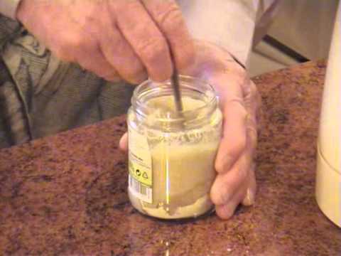

## Домашняя очень острая горчица от дяди Яши

Публикую рецепт очень острой горчицы, который был обнаружен мною в ходе долгих поисков, ошибок и проб. На выходе получаем продукт, который обязательно вышибет слезу. Даже любители острого краснеют и покрываются потом. А это уже показатель!

Найти стабильно острую горчицу на прилавках магазинов практически невозможно. Среди огромного разнообразия есть толковые производители, но их товары часто исчезают, а иногда встречаются и обычные мошенники: на банке или тюбике изображается картина крайне острого на вкус продукта, а в составе горчицы указан красный перец. На вкус как обычная горчица, заглушенная совершенно другой остротой красного перца.

<iframe width="100%" height="515" src="https://www.youtube.com/embed/1BSLr-lMn7Q" title="YouTube video player" frameborder="0" allow="accelerometer; autoplay; clipboard-write; encrypted-media; gyroscope; picture-in-picture" allowfullscreen=""></iframe>

Рецепт домашней очень острой горчицы был найден на Youtube-канале [Готовим с Дядей Яшей](https://youtu.be/1BSLr-lMn7Q), был несколько раз опробован и получил отличные отзывы всех дегустаторов-едоков.

Рецепт простой и без изысков, но с одной хитростью:

*   Взять банку, в нее высыпать горчичный порошок. До половины или больше.
*   Залить теплой водой <nobr>(50-60°)</nobr> до достижения той консистенции, которая вам по нраву. Тщательно перемешать. Воду можно доливать в процессе перемешивания.
*   Не перемешивая, влить поверх горчицы холодную воду (примерно на два пальца), убрать в холодильник на <nobr>10-12 часов.</nobr>
*   Сливаем воду из банки.
*   Добавляем чайную ложку виноградного уксуса (или обычного уксуса), ч.л. растительного масла, щепотку сахара, большую щепотку соли. Перемешать.
*   Домашняя очень острая горчица готова!

К сожалению, Якова Яковлевича теперь с нами нет, о чем сообщается на [официальном сайте](http://www.d-yasha.com/o-nas.html). Светлая ему память. Его рецепты живут. Я так и называю эту горчицу — горчицей «от Дяди Яши».