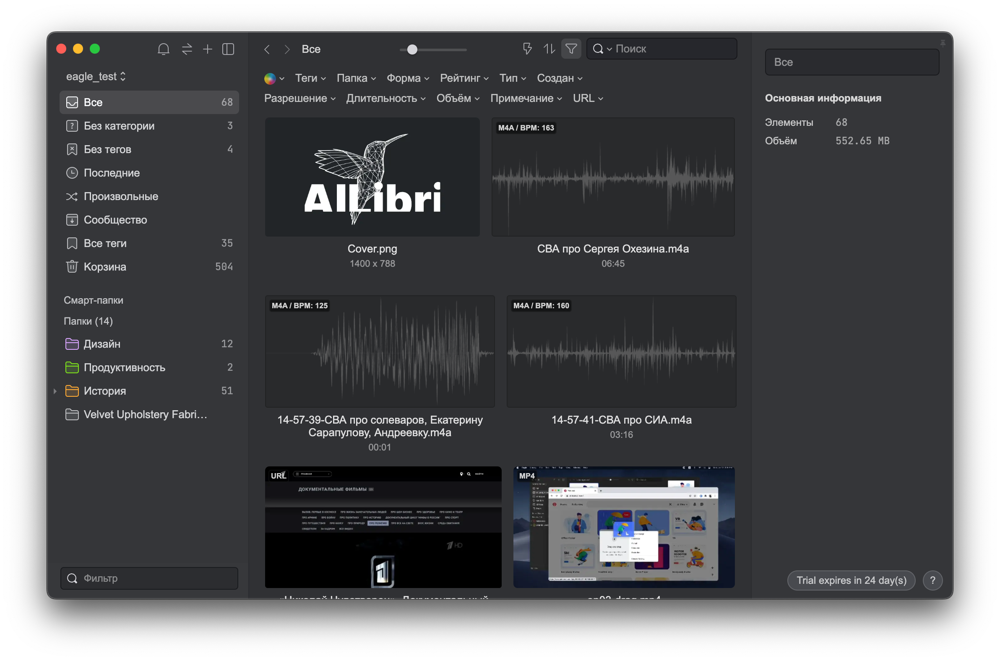
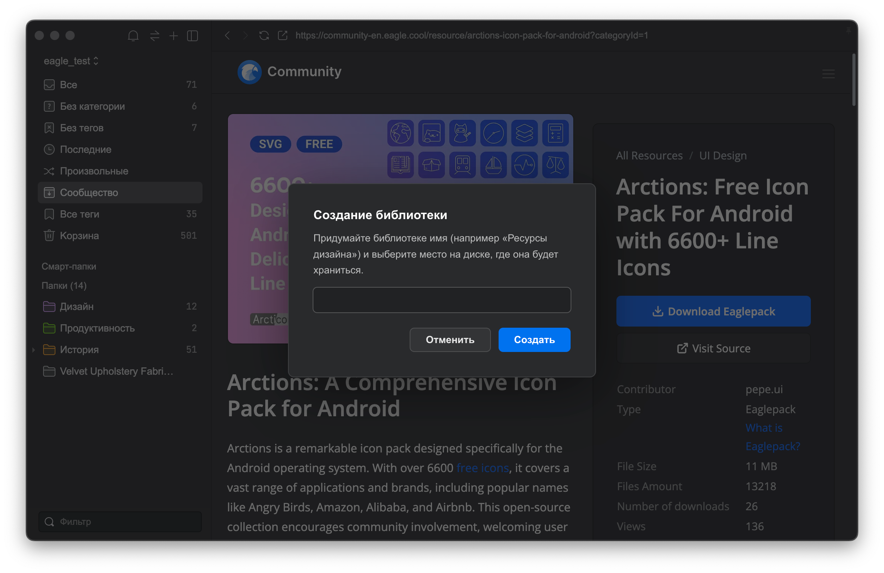
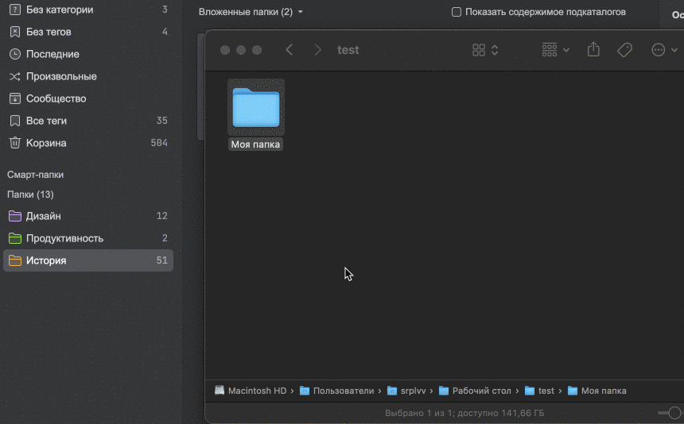
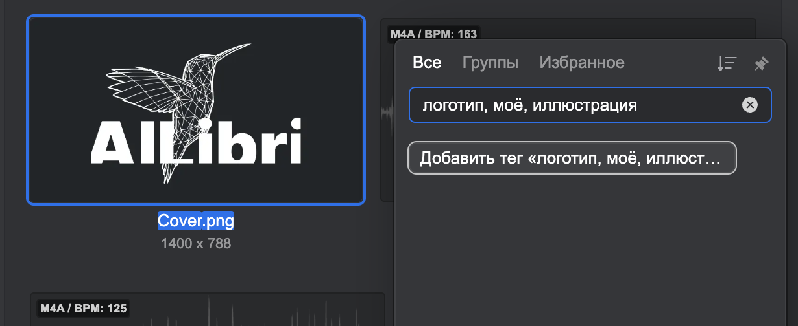
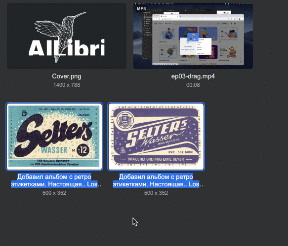
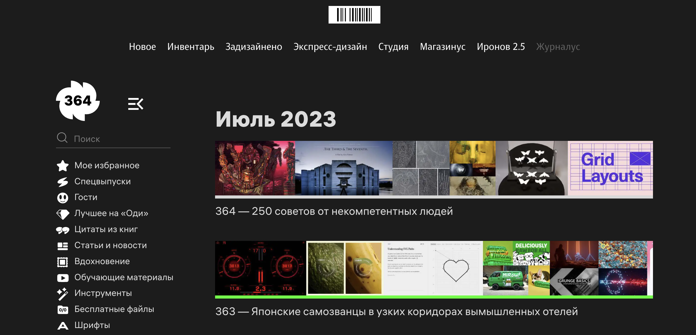
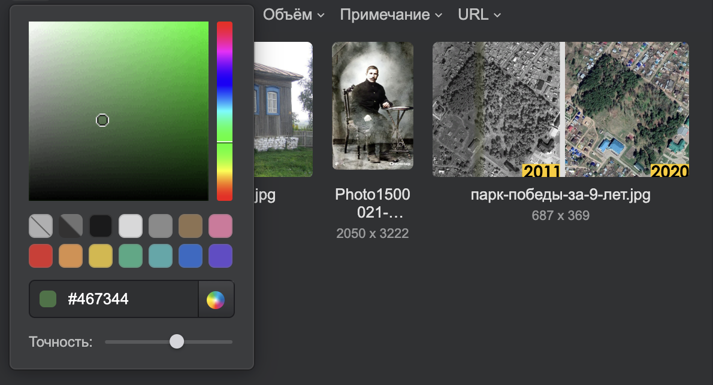
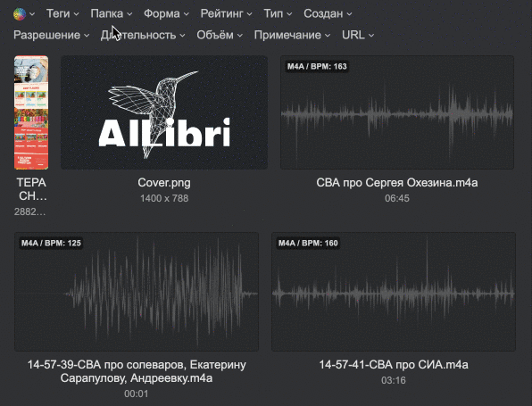

+++
title = 'Как я использую Eagle для дизайнеров'
description = "Статья-обзор о том, как я использую Eagle - программу для дизайнеров, позволяющее прокачивать насмотренность"
tags = [ 'обзор', 'дизайн' ]
slug = 'kak-ya-ispolzuyu-eagle-dlya-dizaynerov'
image = 'index.png'
date = '2023-07-24'
+++

Eagle - первоклассная программа для дизайнеров, которая позволяет прокачивать насмотренность - чувство, которое расширяет креативное воображение и вдохновляет на создание удивительных произведений искусства.

Более десяти лет проработав бок о бок со сферой веб-дизайна, недавно я и сам, наконец, прошёл обучение и получил сертификат UI-дизайнера.

И тем не менее, первым вопросом, который у меня повявился еще до скачивания Eagle был такой: 

>**Можно ли использовать Eagle не только как дизайнер?**
>
>Второй вопрос был более приземленный: **как пополнять коллекцию Eagle с телефона?**

Скачать Eagle можно отсюда: https://ru.eagle.cool/

## Eagle не для дизайнеров

О том, как Eagle помогает работать всем, кому для творчества нужно накапливать *assets* или ресурсы, я слышал не раз. Обзоры Eagle, которые я читал или просматривал - все они о том, что изображения, видео, аудио и даже ссылки (всего около сотни форматов файлов) можно удобно каталогизировать - с тем усердием, которое вас устраивает.

Как правило, речь в этих обзорах идёт о облегчении работы дизайнеров, художников, видеопродюсеров. Но что, если направить в Eagle другие ресурсы? Например, мой исторический архив: снимки людей, исторические карты, старинные фотографии и некоторые другие типы документов, о которых я напишу чуть ниже.

У меня была бесплатная 30-дневная версия и я рискнул истратить часть дней именно на эту работу.

Я веду [блог о старинном селе Николо-Берёзовка](https://n-ber.ru/), почти пятивековой возраст которого позволил ему “повидать” некоторых исторических личностей и “поучаствовать” во многих исторических событиях.

Ресурсы для этого блога - фотографии, карты, схемы, открытки, буклеты в PDF, были незамедлительно отправлены в Eagle, сразу после того, как я завел новую библиотеку.

>Важно понимать, что библиотека Eagle - является внутренним хранилищем программы - папкой, в которой будет хранится вся информация, в том числе, ваши ресурсы.
>К примеру, если отправить фотографию в Eagle, то хранить ее где-то еще дополнительно не нужно.

Я рекомендую содавать библиотеку Eagle в облачном сервисе: в России лучше всего подойдет Яндекс Диск. Mail Облако тоже прекрасно, но его лимиты по скорости могут вас разочаровать.

### Папки в Eagle

Первым делом я целиком перетягиваю папку с названием “Николо-Берёзовка” прямо из Finder в Eagle. Копируются не только все файлы, но и все вложенные папки с сохранением структуры. Разумеется, всё это можно было сделать вручную.

Одним движением я скопировал свой архив в Eagle. Осталось “раздать” каждой папке по своему цвету или даже назначить собственный значок.

### Теги в Eagle

Теги в Eagle помогли решить проблему каталогизирования изображений и ресурсов. Они делают вашу библиотеку более структурированной и упорядоченной. Вы можете легко создавать, редактировать, удалять и управлять тегами с помощью Eagle.

Поэтому далее стоит заняться тегами. И здесь можно дать волю фантазии: в Eagle можно создать группы тегов, внутри которых будут теги, объединенные по смыслу.

>Я не раз переписывал и переделывал теги своих ресурсов, но вот какой совет я могу дать: открывайте раздел “Без тегов” и начинайте обрабатывать свои ресурсы по-порядку, в том числе, добавляя сразу несколько тегов через запятую - все они автоматически обработаются Eagle.

Кроме того, можно выделить сразу несколько файлов и назначить им одни и те же теги, а также комментарии, ссылки и даже рейтинг из звезд.

>Расскажу небольшую хитрость: работа с историческими материалами преполагает интервью с очервидцами, поэтому я записал несколько спонтанных воспоминаний с помощью моих Apple Watch и программы Just Press Record. Полученные аудифайлы я просто скинул в Eagle и присвоил им соответствующий тег.
>
>Когда придет время, я расшифрую свои аудиофайлы и также размещу тексты в Eagle с нужным мне тегом (очень хотелось бы сохранять и просматривать в Eagle файлы с разметкой Markdown)

## Eagle для дизайнеров

Eagle и его широкие возможности помогают мне создавать группы ресурсов, при помощи которых я готовлю новые статьи и заметки по истории своей малой родины. Но что насчет дизайна?

### Импорт в Eagle

Дизайн - это то, в чем Eagle раскрывается на 100%. А раз уж я являюсь UI-дизайнером, то я должен рассказать и об этой стороне. Вот как я действовал сначала:

1. Установил [официальное расширение Eagle для своего браузера](https://en.eagle.cool/extensions)
2. Отправился на Behance, Dribble, Pinterest, а также заглянул в свой любимый дизайнерский журнал - [Журналус](https://zhurnalus.artlebedev.ru) (в котором я узнал об Eagle), где без труда обычно нахожу референсы

3. Любое понравившееся мне изображение может сразу отправиться в нужную папку Eagle. Достаточно сделать долгий клик на нем и перетянуть файл в нужный каталог в удобном всплывающем меню. Кроме того, я могу сохранить все изображения с нужной мне страницы (здесь нужно быть осторожным с длинными ajax-лентами как в Pinterest).

4. Примерно таким же путем в Eagle попадают шрифты, ссылки на сайты с красивым дизайном, видеоуроки, аудиофайлы - всё то, что представляет для меня интерес.
5. Если я пользуюсь мобильным телефоном, то временно отправляю всё найденное в избранное своего Telegram-аккаунта, чтобы после разобрать и отправить в “гнездо Орла”. Это тонкий момент, который тоже хотелось бы решать по-другому. Я никогда не слышал о планах Eagle запустить мобильное приложение. но, как минимум, разрабочики имеют [некоторую позицию](https://docs-en.eagle.cool/article/804-will-eagle-have-a-mobile-or-tablet-version-in-the-future) по этому поводу. Важное дополнение, оказывается, можно настроить автоимпорт в Eagle из любой папки. Я создал папку в облаке на Яндекс Диске. Теперь могу наполнять ее и с телефона (например, могу написать Telegram-бота). При включении Eagle отсканирует эту папку и загрузит ее содержимое к себе, очистив папку.
6. Далее - раскладывание по папкам и теггирование.

### Работа с ресурсами

Напкопительство ресурсов - не самое важное в дизайне. Главное - уметь воспользоваться, уметь вспомнить и найти нужный файл.

#### Фильтрация по цвету

Одна из полезных функций Eagle — это фильтрация по цвету. Фильтрация по цвету позволяет быстро найти изображения, которые имеют определенную цветовую тональность

Это очень полезно, когда вы хотите найти изображения, которые соответствуют определенной цветовой схеме или настроению.

#### Еще фильтры

Кроме фильтрации по цвету, Eagle также предлагает другие виды фильтрации, которые помогают вам находить нужные ресурсы по разным критериям.

Например, вы можете использовать фильтр по тегам, чтобы искать изображения по тегам и их комбинациям. Вы также можете использовать расширенный фильтр, чтобы комбинировать разные условия поиска, такие как формат файла, форма изображения, размер изображения, оценка и т.д.

>Мне очень понравилась работа формы поиска: можно написать теги, по которым нужен результат, но в то же время, можно написать ислючающие теги, результаты по которым не нужны!
>Делается это так: *тег_1 -тег_2*

#### Смарт-папки

Еще один вид фильтрации ресурсов в Eagle - это смарт-папки, которые позволяют вам автоматически сортировать и группировать ваши изображения по заданным критериям. Смарт-папки - это не обычные папки, а динамические коллекции, которые обновляются в реальном времени в соответствии с вашими настройками.

Иными словами, вы можете настроить свои собственные комбинации фильтров и время от времени к ним обращаться через одно нажатие.

## Самое большое изменение, которое принес Eagle

Самое большое изменение, которое принес мне Eagle - это возможность усадить кого угодно перед экраном, взмахнуть волшебной палочкой, нажать на пробел и сказать - **смотри, что у меня есть**!

И чаще всего я усаживаю перед экраном с Eagle самого себя, чтобы снова заглянуть в свои усердно упорядоченные сокровищницы и найти самый яркий на сегодняшний день бриллиант.

## P. S.

Еще одна интересная особенность в Eagle - это Сообщество, которое встроено в программу и позволяет вам обмениваться своими ресурсами дизайна с другими пользователями. Сообщество - это специальный раздел в Eagle, где вы можете просматривать, скачивать и комментировать коллекции изображений, созданные другими дизайнерами. Вы также можете загружать свои собственные коллекции и делиться ими с миром.

## Хотелки

1. ИИ-анализ изображений
2. Удобное пополнение библиотеки через смартфон
3. Удобный просмотр библиотеки через смартфон