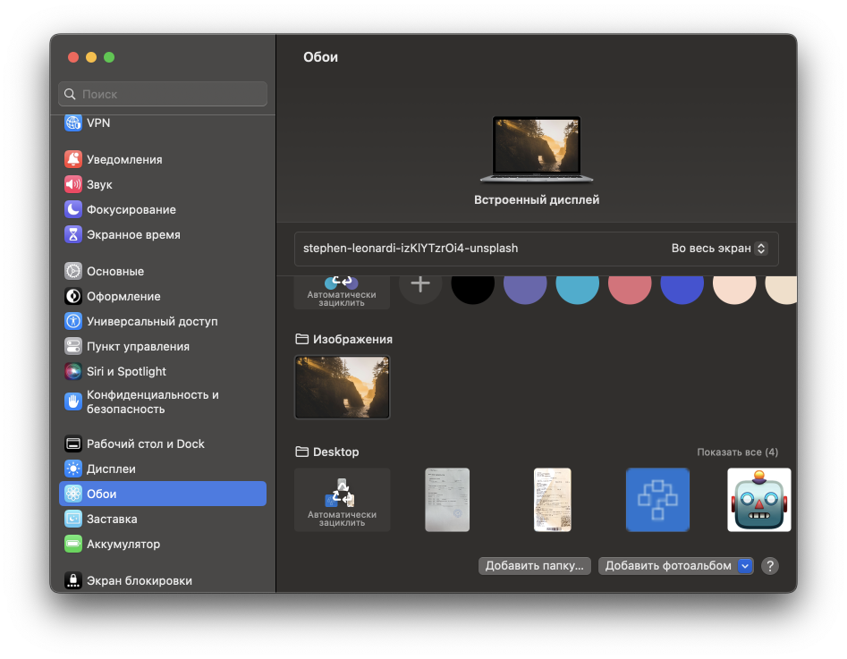

MacOS не имеет приличного менеджера для работы с обоями рабочего стола. В отличие от Windows, здесь нельзя установить обои из меню правой кнопки мыши, нельзя установить обои из экрана просмотра изображения, как впрочем, нельзя и просто так установить любую скачанную картинку на рабочий стол. Для этого нужно открыть Системные настройки -> Обои и внизу добавить папку, в которой лежит файл.

В принципе, эту не сложную, но нудную операцию я проделал и в этот раз на своем Macbook Air с Ventura на борту: я скачал картинку на рабочий стол, добавил папку Desktop в "Обоях" и выбрал нужный файл. Но проблема оказалась в следующем: после перезагрузки изображение на рабочем столе попросту удалялось, иными словами обои возвращались на те, что были установлены по умолчанию.

Решение простое:
1. Копируем файл с обоей в буфер обмена
2. В Finder нажимаем Command + Shift + H - откроется домашняя директория
3. Открываем папку Изображения и вставляем в нее файл
4. В настройках Системные настройки -> Обои появится ваше изображение, его нужно выбрать.

Собственно, вот после таких манипуляций обои на маке не должны удаляться после перезагрузки системы.