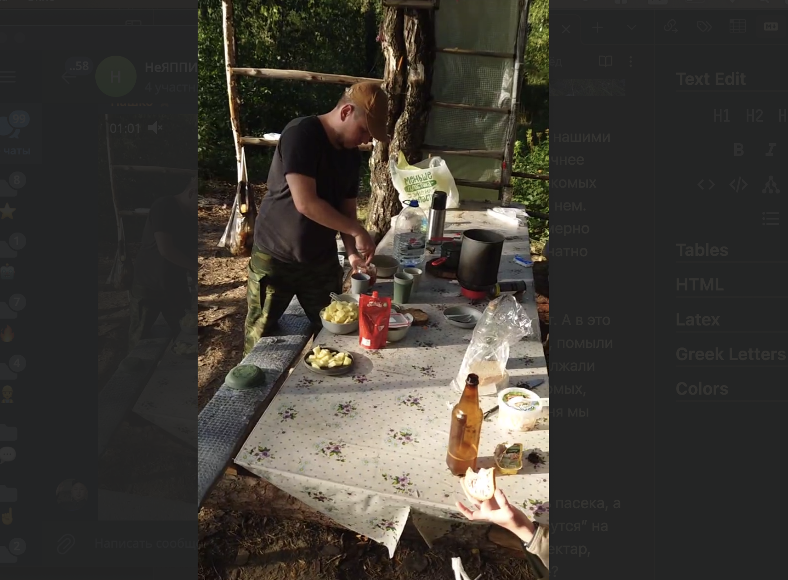
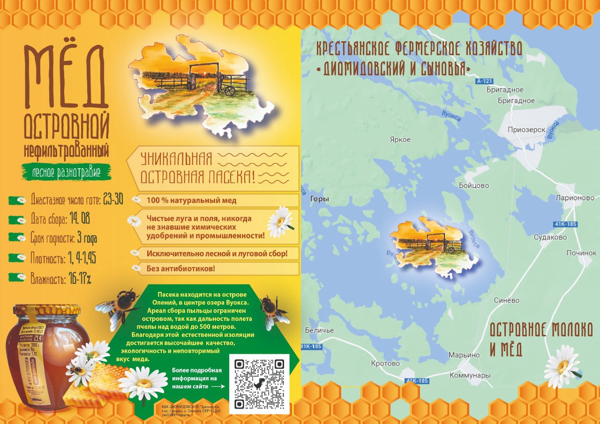
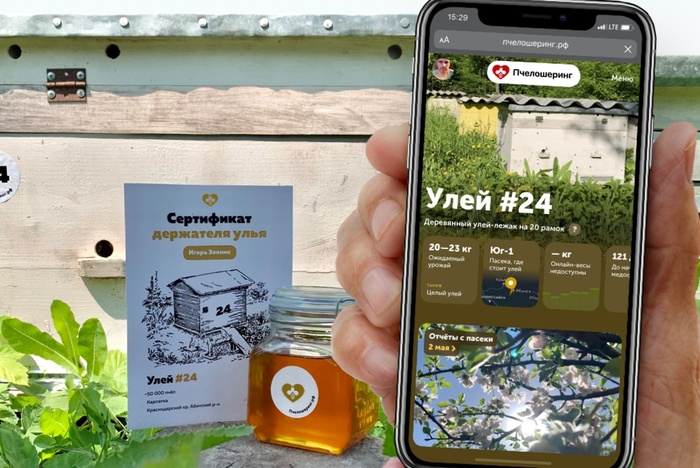
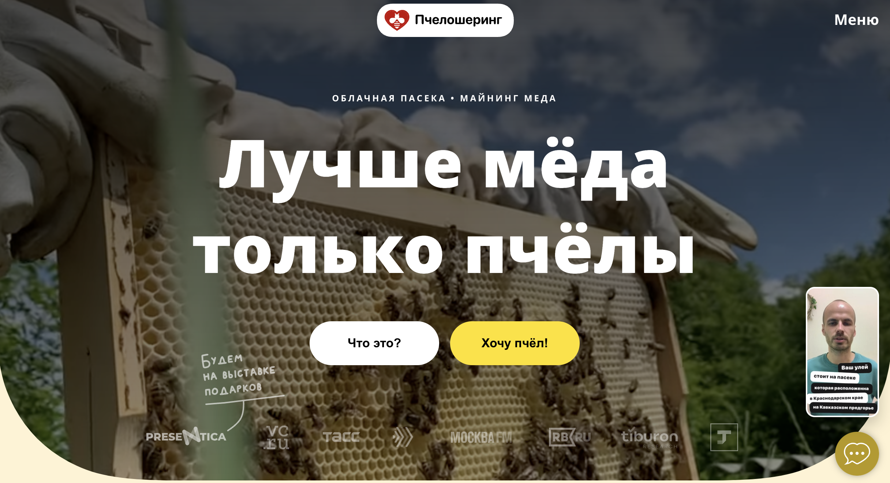
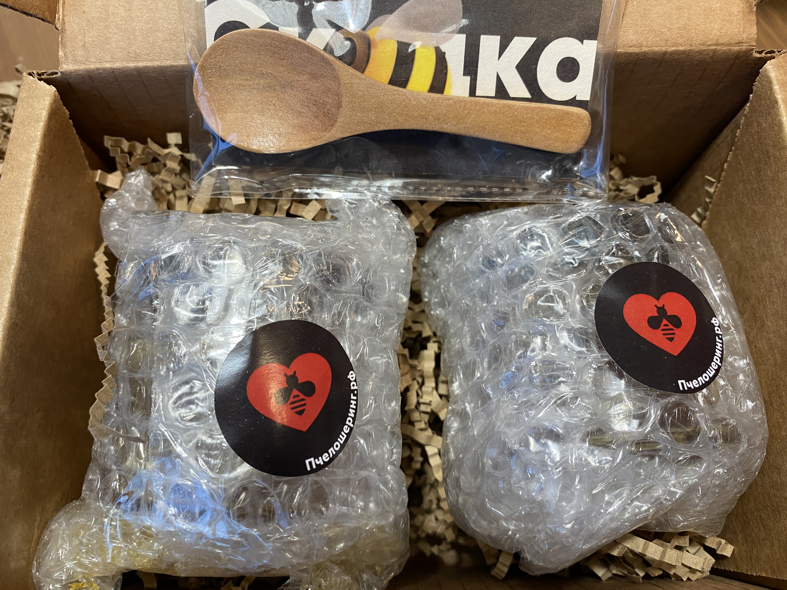
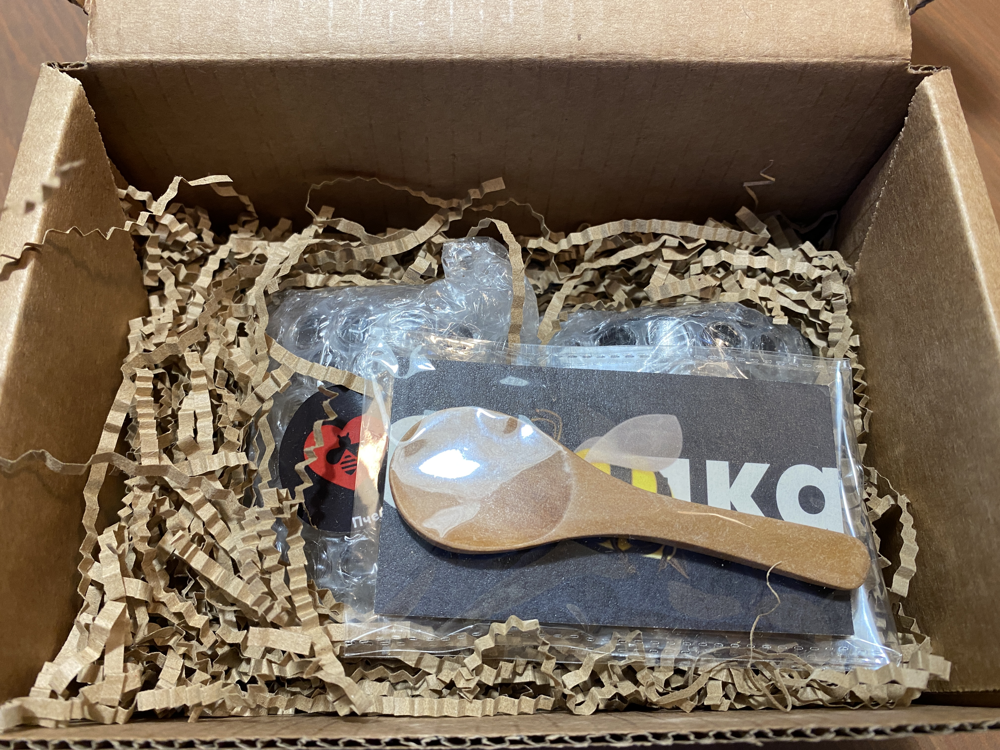

## Пчёлы на Вуоксе

Неделю назад я с друзьями бывал на озере Вуокса в районе города Приозерск. Место это усеяно десятками островов с оборудованными стоянками. Можно приплыть на моторной лодке на один из них, тем самым разнообразить щепоткой “робинзониады” свой отдых на природе.

Мы выбрали место на острове Щук, напротив острова Цоя. Пожалуй, одна из самых продвинутых стоянок: балаган с каркасом под тент, стол со скамьями, качели, костровое место и даже туалет, стоящий в отдалении.

Так вот, к чему я об этом пишу? А к тому, что нашими “соседями” по этому месту стал рой пчёл, точнее какая-то часть роя. Несколько десятков насекомых облепили наши стол и все вещи, лежащие на нем. Особенно интересовались сладким и равномерно распределились за трехметровым столом, знатно потеснив нас.

Пчёлы прилетали и улетали каждые 20 минут. А в это время мы перемыли посуду, убрали сладкое, помыли стол. Пчел стало меньше, но они так и продолжали летать до захода солнца. Аэрозоли от насекомых, дым от костра особо не помогали. К концу дня мы даже к ним привыкли, тем более, что они не проявляли никакой агрессии.

Уже позже я узнал, что где-то на Вуоксе есть пасека, а местные пчелы, похоже, таким образом “пасутся” на туристических стоянках. Зачем цветочный нектар, если есть, к примеру, сладкая кола в стакане?

Насекомые меня “любят” и тот факт, что пчёлы меня проигнорировали, и я благополучно провел выходные с кучей опасных насекомых меня немного озадачил.

## Пчелошеринг - что это такое?

И тут я вспомнил про то, как в комментариях к “субботнему самопиару” на VC, я познакомился с Артёмом Жаровым, основателем продвинутой пасеки в горах Кавказа.

[Пчелошеринг](https://пчелошеринг.рф/) - агротех стартап, который предлагает арендовать пчелиный улей из любой точки страны. Всю работу за вас сделают профессионалы, вы можете контролировать через свой аккаунт на сайте. Результат работы пчелофермеров - мёд, суммарным количеством до 20-23 кг за сезон - упакуют так, как вам нужно и отправят к вашему столу.

По приезду домой я задал вопрос Артёму об этой ситуации на Вуоксе и тот подтвердил, что пчёл, скорее всего, привлекло что-то сладкое. Они  чувствительны к запахам, скорее всего, что-то было на нашем столе или рядом.

## Посылка от Пчелошеринга

Кстати, там же в каментах на vc я попросил банку мёда на пробу с этой пасеки…

…И через пару недель на СДЭК пришла вот такая коробка:

Внутри под слоем упаковки лежало две баночки мёда, одна из которых, к сожалению, умудрилась лопнуть при транспортировке.

Не беда, в моей семье все любят мёд (особенно башкирский), поэтому целая баночка была мгновенно вскрыта.

А еще в посылку была приложена прикольная деревянная ложка, детям очень понравилась.

Не стану расписывать как сомелье, но мёд, который отправили Пчелошеринг - ароматный и вкусный, каким бывает свежий мёд. Фотографий мёда не будет, потому что его съели за один день =)

Иногда неожиданные встречи с пчёлами на природе или с интересными проектами, как Пчелошеринг (в комментариях на vc), могут добавить ярких красок в нашу повседневную жизнь. И вдвойне приятно, когда инновации могут донести до нас дары природы. Пчелошеринг 👍.