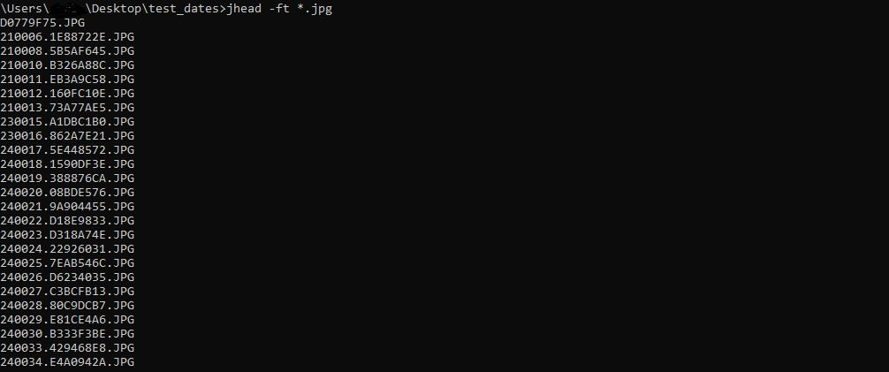

# Поменять дату создания у файлов изображений
Проблема: есть фотки, в которых правильная “дата съемки” в EXIF, но неправильная дата создания (и изменения) файла. Нужно их “синхронизировать”.

1. Заходим на [сайт утилиты jhead](https://www.sentex.ca/~mwandel/jhead/) и скачиваем jhead.exe. Этот файл закидываем в папку windows.
2. Открываем командную строку, пишем `cd` и вставляем адрес папки с фотографиями. Получается типа `cd c:\photos` и жмем Enter
3. Затем пишем `jhead -ft *.jpg` и всё, все фотографии в папке получат дату создания и изменения из даты съемки EXIF.

Может быть актуально, например, при переносе фотографий из одного облака в другое.

Чтобы удостовериться в корректности выполненной операции, в проводнике выберите “Вид - Таблица”, затем ПКМ по столбцам - Подробнее и выбрать “Дата съемки”.

Еще команда для изменения jpg-файлов в сетевом диске:
`jhead -ft "O:\Photo\Google Photo\2020\5\*.jpg"`

А вот команда для видео mp4 и mov, которые имеют правильную "Дату создания мультимедия" и неправильную "Дату создания":

`exiftool "-FileCreateDate<AllDates" -if "not $datetimeoriginal" *.mp4 *.mov`

Exiftool нужно предварительно установить, конечно же.