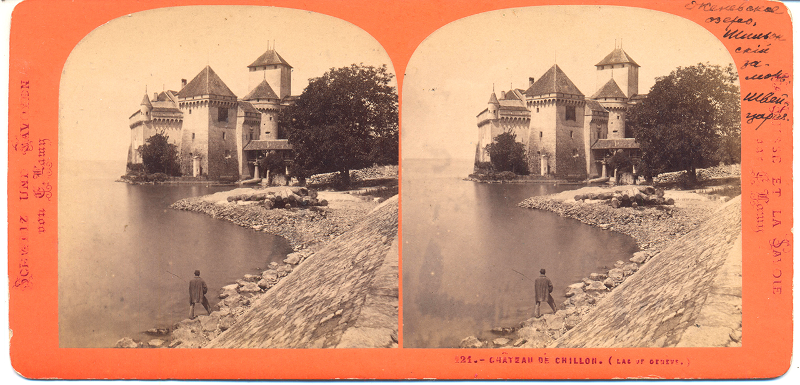

# Шильонский замок и актеры русского музыкального театра

Несколько лет назад купил на Озоне два старинных снимка. Этот поступок вообще не нес какого-то особого смысла — я просто приобрел то, что радовало глаз. Решил, наконец, опубликовать их «с потрохами», — вдруг кому-нибудь понадобится.

**Стереопара «Женевское озеро, Шильонский замок»**

> Стереопара. Швейцария (начало XX века). Размер одного изображения 7,7×7,8 см. Размер стереокарты 17,7×8,7 см. Сохранность хорошая. Временные пятна. Незначительные царапины. Владельческие пометы.

**Актеры русского музыкального театра XIX — начала XX веков.**

> Фотография Везенберга, Санкт-Петербург, конец XIX века. Размер 6,5×10,5 см. Сохранность хорошая. Легкие временные пятна. В левом нижнем углу незначительный потек. На обороте владельческие пометы.

Кстати, описания процитированы с того же Озона ([1](https://www.ozon.ru/context/detail/id/5133802/) и [2](https://www.ozon.ru/context/detail/id/4488611/)), который уже много лет заботливо хранит изображения и подробное описание этих карточек.

Добавлю: владельческая помета сообщает нам, что на второй фотографии «справа актер Фигнер». По всей видимости — оперный певец [Николай Николаевич Фигнер](https://ru.wikipedia.org/wiki/%D0%A4%D0%B8%D0%B3%D0%BD%D0%B5%D1%80,_%D0%9D%D0%B8%D0%BA%D0%BE%D0%BB%D0%B0%D0%B9_%D0%9D%D0%B8%D0%BA%D0%BE%D0%BB%D0%B0%D0%B5%D0%B2%D0%B8%D1%87), брат знаменитой [Веры Фигнер](https://ru.wikipedia.org/wiki/%D0%A4%D0%B8%D0%B3%D0%BD%D0%B5%D1%80,_%D0%92%D0%B5%D1%80%D0%B0_%D0%9D%D0%B8%D0%BA%D0%BE%D0%BB%D0%B0%D0%B5%D0%B2%D0%BD%D0%B0), революционерки из Народной воли.

Цитата из Википедии:

> Артистическим талантом Фигнера восхищался П. И. Чайковский, посвятивший ему шесть романсов <...>. Фигнер первый из русских оперных певцов соединил драматическое, сценическое и вокальное в единую систему оперного действия.

А [Шильонский замок](https://ru.wikipedia.org/wiki/%D0%A8%D0%B8%D0%BB%D1%8C%D0%BE%D0%BD%D1%81%D0%BA%D0%B8%D0%B9_%D0%B7%D0%B0%D0%BC%D0%BE%D0%BA) все также хорош:

Хайрезы [тут](https://cloud.mail.ru/public/K5y9/q5USkDSQo)