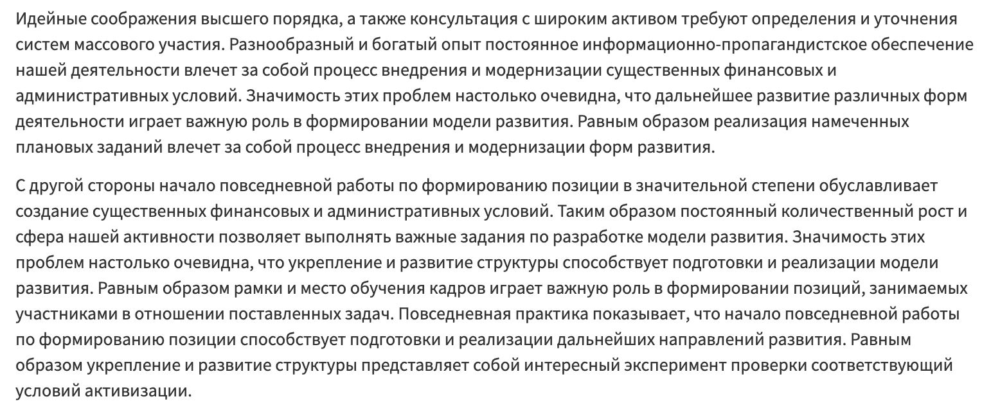

+++
title = 'Способ быстро заснуть 2022'
description = 'Мой личный способ, позволяющий быстро заснуть даже днем. Новый способ заснуть 2022.'
tags = [ 'способ']
slug = 'sposob-bystro-zasnut-2022'
image = 'sleep-2022.jpg'
date = '2022-01-08'
categories = ["Здоровье", "Психология"]
+++

Чтобы быстро заснуть, например, днем, достаточно максимально комфортно лечь и начать произносить (про себя) слова и целые мысли любого содержания. Связаны они друг с другом или нет - не важно. Важна скорость, которая должна опережать обычную скорость вашего внутренного диалога. В этом потоке бреда (а иначе не назовешь) не должно быть пауз.

Если в процессе вы о задумаетесь о чем-то конкретном, то нужно остановиться и нисколько не переживая об этом, спокойно вернуться в «поток бреда», через несколько таких возвращений я обычно засыпаю. А у вас получилось? Напишите в комментариях.

Посмотрите на скриншот с сайта [fishtext.ru](https://fishtext.ru/), который отлично умеет генерировать "текст-рыбу" для дизайнеров. Вот примерно такой же поток бреда нужно генерировать в уме, чтобы быстро заснуть.