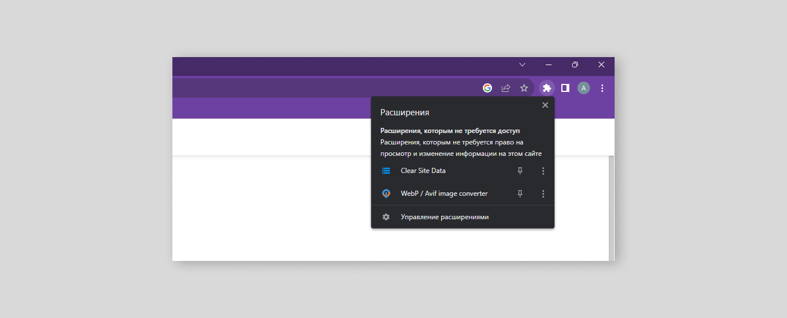
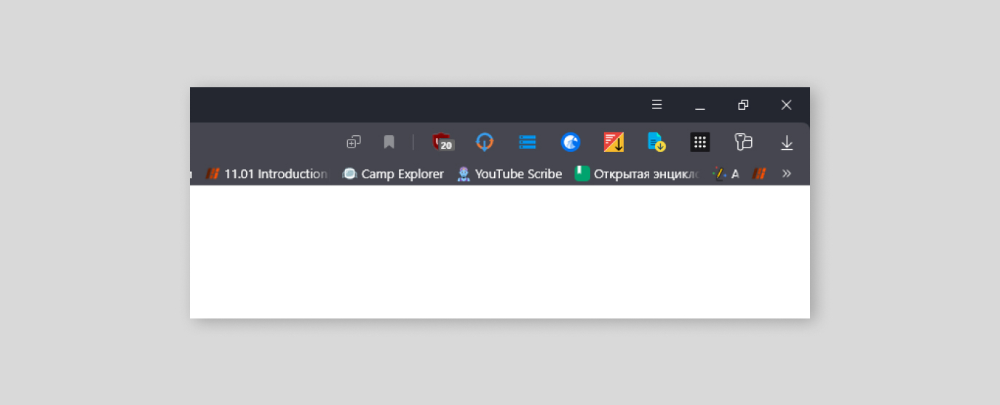
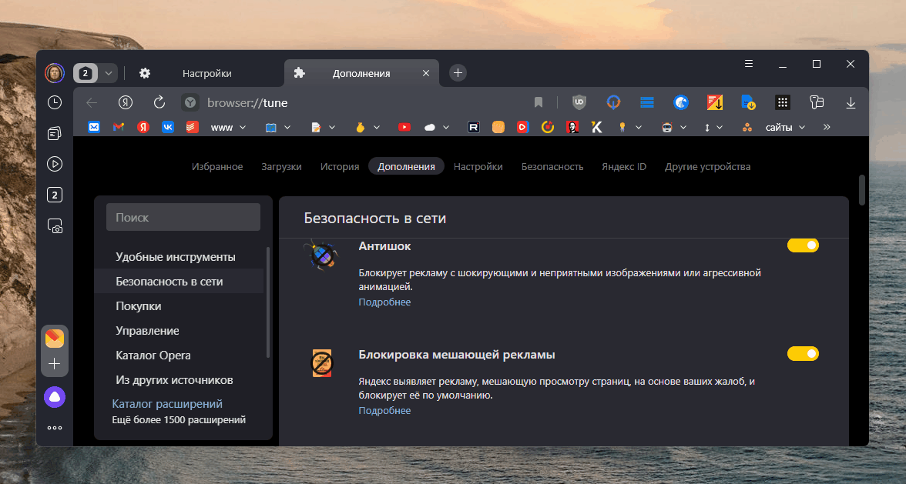

Пару лет пользуюсь Яндекс Браузером, но всегда удручал вид верхней панели, в которой беспрепятственно "селились" разноцветные значки расширений.

Да, их можно скрыть по ПКМ → Скрыть расширение, но вернуть обратно будет уже не так просто: Настройки → Дополнения → прокрутить вниз, чтобы пропустить рекламный мусор и передвинуть ползунок напротив того дополнения, которое нужно вернуть на панель.

В Chrome выглядит все гораздо проще: нажатие на кнопку с иконкой пазла и можно открыть или закрепить любое дополнение.

Короче, в Яндекс Браузере такой кнопки нет. Как нет ни одной настройки, посвященной этому. Поэтому, чтобы убрать этот зоопарк с панели, нужно потянуть за разделитель, который начинается сразу за правым краем адресной строки. И тогда значки расширений скроется в кнопку с тремя точками. Вот такой UI в Яндекс Браузере.

P.S. Еще бы добавили пару пикселей пэддинга снизу к панели быстрого доступа, уж больно выглядит "поджатой".
P.P.S. Devtools, открывающийся по F12, в Яндекс Браузере зачем-то подгружает панель быстрого доступа и имеет ограничения по минимальной ширине окна - очень неудобно.