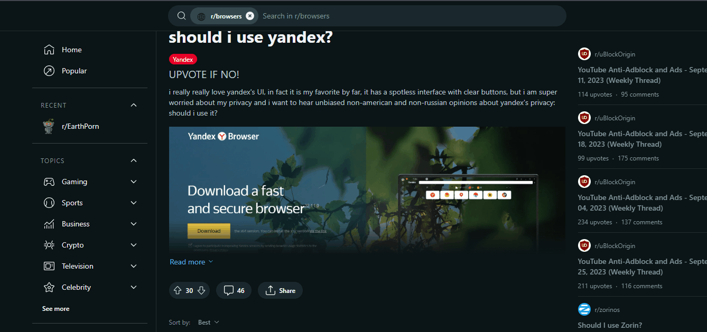
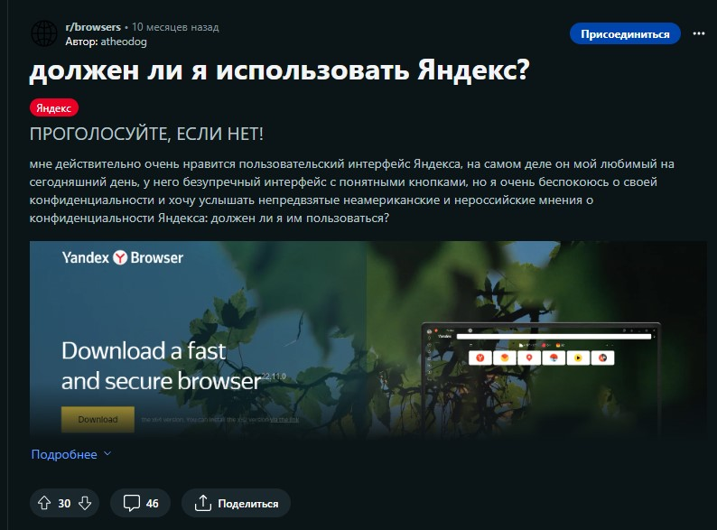

Проблема в следующем: если в Яндекс Браузере перейти на Reddit и выполнить полный перевод страницы через ПКМ -> Перевести на русский, то текст на сайте просто исчезает.




Если быть точнее, то переведенный Яндекс Браузером текст на Реддите приобретает CSS-стиль `visibility: hidden;`. Причем, в Chrome всё работает отлично. Я писал в техподдержку, но, к сожалению, проблема так и не была решена.

Берём всё в свои руки:
1. Устанавливаем расширение  [User JavaScript and CSS](https://chrome.google.com/webstore/detail/user-javascript-and-css/nbhcbdghjpllgmfilhnhkllmkecfmpld)
2. Переходим на Reddit, справа вверху нажимаем на кнопку расширения и на жёлтую кнопку “Добавить”
3. В открывшемся окне в поле имя вводим `Reddit-translate-fix`, в поле с адресом  `https://www.reddit.com/*`
4. В правой большой текстовой области (CSS) вставляем следующее:

```
:not(:defined):not(faceplate-auto-height-animator,faceplate-dropdown-menu,faceplate-expandable-section-helper,faceplate-hovercard,faceplate-tracker){

visibility: visible !important;

}
```

Нажимаем кнопку Сохранить, после чего видим, что страница отображается нормально, и Яндекс Браузер корректно показывает переведённую страницу Reddit’a.



